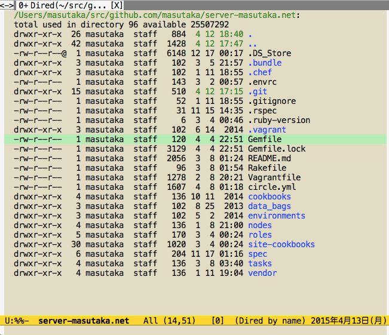

# helm-bundle-show.el [![melpa badge][melpa-badge]][melpa-link] [![melpa stable badge][melpa-stable-badge]][melpa-stable-link]

## Introduction

`helm-bundle-show.el` provides interfaces of `$ bundle show` with helm.

## Screenshot



## Requirements

* Emacs 24 or higher
* helm 1.6.9 or higher
* bundler

## Installation

You can install `helm-bundle-show.el` from [MELPA](https://github.com/milkypostman/melpa.git) with package.el (`M-x package-install helm-bundle-show`).

## Usage

### `helm-bundle-show`

* Execute with `$ bundle show | awk 'NR>1 {print $2}'`.
* You can select a directory from the results.

### `helm-for-files`

Require the following configuration.

```lisp
(add-to-list 'helm-for-files-preferred-list 'helm-bundle-show--source)
```

[melpa-link]: http://melpa.org/#/helm-bundle-show
[melpa-stable-link]: http://stable.melpa.org/#/helm-bundle-show
[melpa-badge]: http://melpa.org/packages/helm-bundle-show-badge.svg
[melpa-stable-badge]: http://stable.melpa.org/packages/helm-bundle-show-badge.svg
