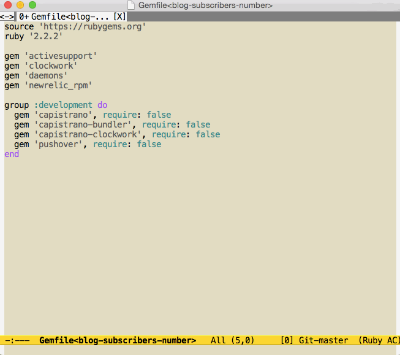

# helm-bundle-show.el [![melpa badge][melpa-badge]][melpa-link] [![melpa stable badge][melpa-stable-badge]][melpa-stable-link]

## Introduction

`helm-bundle-show.el` provides interfaces of `$ bundle show` with helm.

## Demo

You can open the gem directory from the results.


Also you can choose some actions with `<TAB>` key.



## Requirements

* Emacs 24.5 or higher
* helm 1.8.0 or higher
* bundler 1.11.2 or higher

## Installation

You can install `helm-bundle-show.el` from [MELPA](https://github.com/milkypostman/melpa.git) with package.el (`M-x package-install helm-bundle-show`).

## Usage

### `helm-bundle-show`

* Execute `$ bundle show`.
* You can open the gem directory from the results.
* Also you can choose the following actions with `<TAB>` key.
    * Open Directory (default)
    * Open Directory other window
    * Open Directory other frame
    * Browse RubyGems url (ex. https://rubygems.org/gems/rails)
    * Copy RubyGems url

### `helm-for-files`

Require the following configuration.

```lisp
(add-to-list 'helm-for-files-preferred-list 'helm-bundle-show--source)
```

[melpa-link]: http://melpa.org/#/helm-bundle-show
[melpa-stable-link]: http://stable.melpa.org/#/helm-bundle-show
[melpa-badge]: http://melpa.org/packages/helm-bundle-show-badge.svg
[melpa-stable-badge]: http://stable.melpa.org/packages/helm-bundle-show-badge.svg
